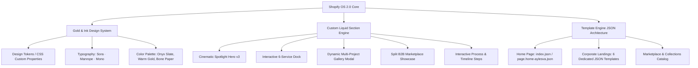

# 🌟 Grupo Aylesva — Enterprise E-Commerce & Multi-Vertical Ecosystem
### Custom Shopify Online Store 2.0 Theme · Gold & Ink Design System · Modern Liquid Architecture

[](https://shopify.dev)
[](https://shopify.dev/docs/api/liquid)
[](https://www.w3.org/Style/CSS/)
[](https://developer.mozilla.org/en-US/docs/Web/JavaScript)
[](#-arquitectura-uxui-mobile-first)
[](#-seguridad-y-mejores-prácticas)

---

## 📌 Resumen Ejecutivo del Proyecto (Executive Summary)

**Grupo Aylesva** es una plataforma corporativa y comercial de alto nivel construida a la medida sobre **Shopify Online Store 2.0**. El proyecto consolida un ecosistema empresarial multi-vertical que abarca 6 divisiones de negocio estratégicas y un marketplace integrado para los mercados de **México** y **Estados Unidos**:

1. **🏢 Global Estates:** Inversión y desarrollos inmobiliarios prémium de alta plusvalía (*Torre 40 Puerto Vallarta, Altarena, Paradise Bay*).
2. **💳 Aylesva Recursos:** Fintech y soluciones de financiamiento/capital de trabajo para empresas y emprendedores.
3. **🚢 Aylesva Direct:** Logística internacional y gestión de importaciones puerta a puerta desde Asia (China a México / USA).
4. **🛍️ Lanza tu Propia Marca:** Incubadora de e-commerce con catálogo sincronizado, dropshipping y logística automatizada.
5. **🩺 Aylesva Care:** Servicios de asistencia médica, telemedicina 24/7 y bienestar patrimonial en alianza con *New Benefits*.
6. **✈️ Mi Última Voluntad:** Membresía de asistencia familiar y coordinación de repatriación funeraria internacional México-EE. UU.
7. **🤠 Marketplace B2B & B2C:** Catálogo de más de 2,000 productos prémium de moda country, calzado vaquero artesanal, sombreros texanos y talabartería con compra directa y precios de mayoreo escalonados.

---

## 🏗️ Arquitectura Técnica & Pilares de Ingeniería



### 1. 🎬 Gran Vitrina Cinemática & Hero v3 (`aylesva-home-hero-v3.liquid`)
- **Stage Cinemático (4x más grande):** Escenario visual dinámico con efecto continuo **Ken Burns** (`scale(1.0) -> scale(1.08)`), viñeta editorial y disolución cruzada suave (*crossfade*).
- **Dock de Navegación Interactivo de 6 Servicios:** Botonera ergonómica con miniaturas, íconos vectoriales SVG y barra de progreso dorada en vivo sincronizada con el temporizador de rotación.
- **Jerarquía Reordenada para Móvil:** En pantallas táctiles, la vitrina visual se posiciona *above-the-fold* para comunicar la propuesta de valor ("Qué hacemos") desde el primer segundo.

### 2. 🎨 Sistema de Diseño Corporativo "Gold & Ink" (`aylesva-corp-tokens.liquid`)
- **Variables CSS Centralizadas:** Paleta inspirada en arquitectura y editorial de lujo (`--ay-gold: #C5A47E`, `--ay-ink-900: #020617`, `--ay-stone: #F8F7F4`).
- **Composición Tipográfica:** Encabezados en **Sora**, cuerpos de texto optimizados en **Manrope** y etiquetas de precisión técnica en **JetBrains Mono**.
- **Componentes Modulares:** Tarjetas con elevación sutil, divisores capilares (*hairlines*), distintivos flotantes y botones con micro-interacciones de alta fidelidad.

### 3. 📄 Plantillas Modulares Shopify OS 2.0
- Arquitectura desacoplada basada en archivos JSON estructurados:
  - `page.globalestates.json`
  - `page.aylesva-recursos.json`
  - `page.aylesva-direct.json`
  - `page.aylesva-care.json`
  - `page.lanza-tu-propia-marca.json`
  - `page.mi-ultima-voluntad.json`
  - `page.marketplace.json`
  - `page.home-aylesva.json` / `index.json`
- Cada sección incluye esquemas (*schemas*) tipados para control total de textos, enlaces, imágenes, trazados SVG y configuraciones desde el editor visual de Shopify sin tocar código.

### 4. 🛍️ Marketplace B2B & B2C Híbrido
- Soporte para compra individual al menudeo y compras a mayoreo con reglas comerciales escalonadas.
- Integración para sincronización con tiendas Shopify de clientes terceros (Dropshipping B2B).
- Galería interactiva con filtrado rápido por categorías (Moda vaquera, Calzado artesanal, Sombreros texanos, Talabartería fina).

---

## 📱 Arquitectura UX/UI Mobile-First

El tema fue diseñado bajo el principio de **máximo impacto en pantallas móviles**:
- **Carga Visual Prioritaria:** La fotografía del servicio activo y su propuesta de valor se despliegan en los primeros 300px del viewport móvil.
- **Interacción Táctil Ergonómica:** El dock de servicios se reorganiza en una cuadrícula de 2 columnas optimizada para interacción con el pulgar.
- **Rendimiento Acelerado por GPU:** Transiciones CSS aceleradas por hardware (`will-change: transform`, `transform: translate3d`) garantizando 60 FPS estables.
- **Accesibilidad:** Cumplimiento con estándares WCAG 2.1 AA (contrastes de texto, soporte para `prefers-reduced-motion` y etiquetas ARIA).

---

## 🔒 Seguridad y Mejores Prácticas (Security & Privacy)

Este repositorio ha sido sanitizado siguiendo estrictos protocolos de ciberseguridad para desarrollo en la nube y repositorios públicos/privados:

- ✅ **Cero Credenciales Expuestas:** Ningún token de acceso privado (`shpat_`, `shpca_`), API keys ni contraseñas están almacenados en el código fuente.
- ✅ **Manejo Seguro de Entorno:** Archivo `.env.example` sanitizado con variables simuladas. El archivo `.env` real está estrictamente ignorado vía `.gitignore`.
- ✅ **Protección de Datos Personales (PII):** Sin registros de información confidencial de clientes ni historiales sensibles.
- ✅ **Sanitización de Salidas en Liquid:** Uso consistente de filtros de escape de Liquid (`| escape`, `| strip_html`, `| json`) para prevenir inyecciones XSS.

---

## 📂 Estructura del Repositorio

```text
├── tema_desarrollo/                     # Código fuente del Tema Shopify OS 2.0
│   ├── assets/                          # Fotografías en alta resolución, CSS y JS
│   │   ├── ay-hero-*-warm.jpg           # Suite fotográfica cálida para la Hero v3
│   │   ├── ay-mp-*.jpg                  # Editorial fotográfica de Moda Country
│   │   ├── ay-res-*.jpg                 # Galería de casos de éxito (Torre 40, etc.)
│   │   └── ...
│   ├── config/
│   │   ├── settings_schema.json         # Configuración global del personalizador
│   │   └── settings_data.json           # Valores predeterminados del tema
│   ├── layout/
│   │   ├── theme.liquid                 # Layout maestro con inyección de tokens
│   │   └── gift_card.liquid             # Plantilla de tarjetas de regalo
│   ├── locales/                         # Diccionarios de idioma (es-MX, en, etc.)
│   ├── sections/                        # Secciones personalizadas Liquid
│   │   ├── aylesva-home-hero-v3.liquid  # Gran Vitrina Cinemática & Dock
│   │   ├── aylesva-home-services-v3.liquid # Ecosistema de soluciones
│   │   ├── aylesva-corp-cards.liquid    # Tarjetas con galería modal de planos
│   │   ├── aylesva-corp-hero.liquid     # Hero corporativo Gold & Ink
│   │   ├── aylesva-corp-process.liquid  # Paso a paso interactivo
│   │   ├── aylesva-corp-features.liquid # Bloques de beneficios
│   │   ├── aylesva-home-split.liquid    # Split 2 columnas para Marketplace
│   │   └── ...
│   ├── snippets/                        # Componentes reutilizables
│   │   ├── aylesva-corp-tokens.liquid   # Tokens de diseño y fuentes
│   │   ├── search-bar.liquid            # Buscador institucional
│   │   └── ...
│   ├── templates/                       # Plantillas JSON de páginas y colecciones
│   │   ├── index.json                   # Portada principal
│   │   ├── page.globalestates.json      # Landing Global Estates
│   │   ├── page.aylesva-recursos.json   # Landing Aylesva Recursos
│   │   ├── page.aylesva-direct.json     # Landing Aylesva Direct
│   │   ├── page.aylesva-care.json       # Landing Aylesva Care
│   │   ├── page.lanza-tu-propia-marca.json # Landing Incubadora E-Commerce
│   │   ├── page.mi-ultima-voluntad.json # Landing Mi Última Voluntad
│   │   └── page.marketplace.json        # Landing de Marketplace
│   └── INSTRUCCIONES_IMPLEMENTACION_USA.txt # Guía de despliegue
├── .gitignore                           # Exclusión de archivos sensibles y logs
├── .env.example                         # Plantilla sanitizada de variables de entorno
└── README.md                            # Documentación técnica del proyecto
```

---

## 🛠️ Guía de Desarrollo Local y Despliegue

### Requisitos Previos
- **Shopify CLI** (`npm install -g @shopify/cli @shopify/theme`)
- **Python 3.9+** (opcional para scripts de automatización)
- Cuenta de desarrollo en **Shopify Partners** o acceso a tienda con permisos de temas.

### 1. Clonar el Repositorio
```bash
git clone https://github.com/alexdoven/aylesva-shopify-ecosystem.git
cd aylesva-shopify-ecosystem
```

### 2. Autenticación con Shopify CLI
```bash
shopify auth login
```

### 3. Iniciar el Servidor de Desarrollo Local (Hot-Reload)
```bash
cd tema_desarrollo
shopify theme dev --store tu-tienda.myshopify.com
```

### 4. Desplegar a Tema de Desarrollo o Producción
```bash
# Desplegar en tema de desarrollo remoto
shopify theme push --development --path "./tema_desarrollo"

# Desplegar en vivo (Producción)
shopify theme push --live --path "./tema_desarrollo" --allow-live
```

---

## 🏆 Hitos y Logros Técnicos Destacados

- ⚡ **Rendimiento Optimizado:** Reducción del tiempo de carga interactivo mediante lazy-loading nativo y optimización de vectores SVG inline.
- 🎨 **Consistencia Visual Absoluta:** Unificación de 6 identidades de negocio bajo un único lenguaje visual corporativo (*Gold & Ink*).
- 🌐 **Preparado para Expansión Internacional:** Paquete autónomo listo para despliegue simultáneo en México y Estados Unidos.

---

## 👨‍💻 Autor & Créditos

**Desarrollado y Diseñado por Alex Doven**  
*Lead Full-Stack & Shopify Theme Engineer*  
- 💼 **LinkedIn / Portafolio:** [alexdoven](https://github.com/alexdoven)
- 🚀 **Especialidad:** E-Commerce Architecture, Custom Shopify OS 2.0 Themes, UI/UX Engineering & Design Systems.

---
*© 2026 Grupo Aylesva · Todos los derechos reservados.*
