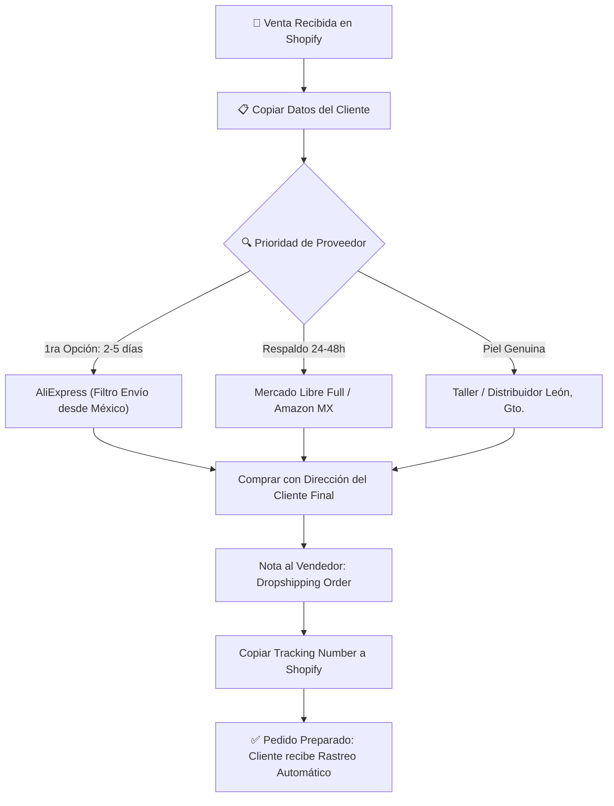

# 📦 Directorio Maestro de Proveedores & Guía de Cumplimiento (Fulfillment Dropshipping)
**Aylesva MX — Sistema de Abastecimiento Rápido con Prioridad en Almacenes de México**

> [!IMPORTANT]
> **Regla de Oro de Abastecimiento Aylesva:** Priorizar siempre proveedores y productos que ya se encuentren **físicamente en bodegas dentro de la República Mexicana** (AliExpress con filtro *"Envío desde México"* o *Mercado Libre Full / Amazon MX*). Esto reduce el tiempo de entrega de 20 días a solo **2 a 5 días hábiles**, elimina riesgos aduanales y maximiza la satisfacción del cliente.

---

## ⚡ 1. ¿Cómo Encontrar Productos con Envío desde México en AliExpress?

1. **Filtro Nativo de Ubicación:**
   * En la barra de búsqueda de AliExpress, tras ingresar el producto, haz clic en el filtro superior o lateral **"Envío desde" (Ship from)** y selecciona **"México"**.
   * URL directa con filtro activado: `https://www.aliexpress.com/wholesale?SearchText=[PRODUCTO]&shipFrom=MX`
2. **Identificación de Entrega Rápida:**
   * Los productos con almacén en México llevan las etiquetas:
     - **"Local Delivery (3-5 días)"**
     - **"Entrega rápida nacional"**
     - Paqueterías locales asociadas: *Estafeta, QualityPost, BigSmart, 99Minutos, Paquetexpress*.
3. **Respaldo Local Express (24 a 48 horas):**
   * Si en AliExpress el stock mexicano de una variante se agota temporalmente, utiliza **Mercado Libre Full** o **Amazon México**: compras el producto con entrega al día siguiente colocando la dirección del comprador de Aylesva.

---

## 🚀 2. Protocolo de Fulfillment Paso a Paso (Cuando cae una venta)

1. **Abre el Pedido:** En [Shopify Admin > Pedidos](https://admin.shopify.com/store/aylesvamx/orders), copia el nombre, teléfono y dirección exacta del comprador.
2. **Ordena en el Proveedor:** Compra el producto y en los datos de destinatario pon los del cliente.
3. **Nota de Envío:** Añade siempre la instrucción:
   > *"Dropshipping order. Please do NOT include invoices, promotions or brand logos in the package. Thank you!"*
4. **Fulfill en Shopify:** Al generarse la guía, pulsa **"Preparar artículos"** en Shopify y pega el número de rastreo.

---

## 📑 3. Catálogo de Proveedores con Almacén Local México

### A. Electrónicos & Smart Living (Prioridad Bodega México)

| Producto | SKU Aylesva | Enlace Proveedor Directo (Stock en México) | Costo Proveedor MX | Precio Venta Aylesva | Tiempo Entrega |
| :--- | :--- | :--- | :--- | :--- | :--- |
| **Difusor Llama de Fuego LED** *(ID: 8947043172375)* | • `DIF-FLAME-BLK` • `DIF-FLAME-WHT` | [AliExpress México: Flame Diffuser (Filtro MX)](https://www.aliexpress.com/wholesale?SearchText=flame+aroma+diffuser+fireplace&shipFrom=MX) • *Respaldo:* [Mercado Libre Full: Difusor Llama](https://listado.mercadolibre.com.mx/difusor-aromas-llama-fuego#shipping_origin=full) | $260 - $310 MXN | **$690.00 MXN** *(+58%)* | **2 - 4 días** |
| **Humidificador Medusa Flotante** *(ID: 8947043205143)* | • `DIF-JELLY-WHT` • `DIF-JELLY-BLK` | [AliExpress México: Jellyfish Diffuser](https://www.aliexpress.com/wholesale?SearchText=jellyfish+aroma+diffuser&shipFrom=MX) • *Respaldo:* [Mercado Libre Full: Difusor Medusa](https://listado.mercadolibre.com.mx/difusor-medusa-anillos#shipping_origin=full) | $290 - $350 MXN | **$780.00 MXN** *(+57%)* | **2 - 4 días** |
| **Base de Carga 3 en 1 MagSafe** *(ID: 8947043270679)* | • `CHG-3IN1-BLK` • `CHG-3IN1-WHT` | [AliExpress México: Cargador 3 en 1 MagSafe](https://www.aliexpress.com/wholesale?SearchText=3+in+1+foldable+magnetic+wireless+charger&shipFrom=MX) • *Respaldo:* [Mercado Libre Full: Cargador 3 en 1 Plegable](https://listado.mercadolibre.com.mx/cargador-inalambrico-3-en-1-plegable-magsafe#shipping_origin=full) | $220 - $270 MXN | **$650.00 MXN** *(+61%)* | **2 - 3 días** |
| **Bocina Sonidos Naturales 360°** *(ID: 8947043368983)* | • `SPK-NAT-GRN` • `SPK-NAT-SND` • `SPK-NAT-WHT` | [AliExpress México: Natural Sound Bluetooth Speaker](https://www.aliexpress.com/wholesale?SearchText=natural+sound+bluetooth+speaker&shipFrom=MX) • *Respaldo:* [Mercado Libre Full: Bocina Ruido Blanco](https://listado.mercadolibre.com.mx/bocina-ruido-blanco-bluetooth#shipping_origin=full) | $260 - $340 MXN | **$720.00 MXN** *(+56%)* | **2 - 4 días** |
| **Audífonos ST99 Degradado** *(ID: 8947043467287)* | • `HP-ST99-BLU` • `HP-ST99-PNK` • `HP-ST99-PUR` • `HP-ST99-GRN` • `HP-ST99-BLK` | [AliExpress México: Audífonos Inalámbricos ST99](https://www.aliexpress.com/wholesale?SearchText=ST99+wireless+headphones&shipFrom=MX) • *Respaldo:* [Mercado Libre Full: Audífonos Bluetooth Diadema](https://listado.mercadolibre.com.mx/audifonos-bluetooth-diadema-degradado#shipping_origin=full) | $160 - $220 MXN | **$590.00 MXN** *(+66%)* | **2 - 4 días** |
| **Pistola Masaje Muscular LCD** *(Próxima incorporación)* | • `MSG-GUN-BLK` • `MSG-GUN-SLV` | [AliExpress México: Pistola Masaje LCD (Bodega MX)](https://www.aliexpress.com/wholesale?SearchText=pistola+masaje+muscular+lcd&shipFrom=MX) • *Respaldo:* [Mercado Libre Full: Pistola Masaje](https://listado.mercadolibre.com.mx/pistola-masaje-muscular-lcd#shipping_origin=full) | $240 - $320 MXN | **$690.00 MXN** *(+59%)* | **24 - 48 hrs** |
| **Aspiradora Inalámbrica Auto/Hogar** *(Próxima incorporación)* | • `VAC-WLS-BLK` • `VAC-WLS-WHT` | [AliExpress México: Mini Aspiradora Inalámbrica](https://www.aliexpress.com/wholesale?SearchText=mini+aspiradora+inalambrica+portatil&shipFrom=MX) • *Respaldo:* [Mercado Libre Full: Mini Aspiradora](https://listado.mercadolibre.com.mx/aspiradora-portatil-inalambrica-auto#shipping_origin=full) | $190 - $260 MXN | **$540.00 MXN** *(+58%)* | **24 - 48 hrs** |

---

### B. Relojería Curren (Almacén México & Envío Choice)

| Producto | SKU Aylesva | Enlace Proveedor Directo | Costo Proveedor | Precio Venta Aylesva | Tiempo Entrega |
| :--- | :--- | :--- | :--- | :--- | :--- |
| **Curren CUR-230 Esqueleto Mecánico** | `CUR-230-...` | [AliExpress: Curren Skeleton Watch (Filtro MX / Choice)](https://www.aliexpress.com/wholesale?SearchText=curren+skeleton+automatic+watch&shipFrom=MX) | $310 - $390 MXN | **$890.00 MXN** *(+60%)* | **3 - 7 días** |
| **Curren CUR-208 Cronógrafo Acero** | `CUR-208-...` | [AliExpress: Curren 8355 Chronograph (Filtro MX)](https://www.aliexpress.com/wholesale?SearchText=curren+8355&shipFrom=MX) | $260 - $320 MXN | **$820.00 MXN** *(+64%)* | **3 - 7 días** |
| **Curren CUR-211 Dual-Time Militar** | `CUR-211-...` | [AliExpress: Curren 8384 Dual Display](https://www.aliexpress.com/wholesale?SearchText=curren+8384&shipFrom=MX) | $240 - $300 MXN | **$790 - $890 MXN** | **3 - 7 días** |
| **Curren CUR-213 Aviador en Piel** | `CUR-213-...` | [AliExpress: Curren 8329 Chrono](https://www.aliexpress.com/wholesale?SearchText=curren+8329&shipFrom=MX) | $230 - $280 MXN | **$760.00 MXN** *(+66%)* | **3 - 7 días** |

---

### C. Marroquinería & Cuero Exótico (Distribución Nacional León, Guanajuato)

| Producto | SKU Aylesva | Abastecimiento Nacional | Costo Proveedor | Precio Venta Aylesva | Tiempo Entrega |
| :--- | :--- | :--- | :--- | :--- | :--- |
| **Cartera Bifold Piel Azteca RFID** | `CUA-WLT-AZT` | **Distribuidor Mayorista / Cuadra León, Gto:** Despacho directo nacional paquetería express | $420 - $480 MXN | **$750.00 MXN** *(+40%)* | **24 - 48 hrs** |
| **Cinturón Pitón Exótico 40mm** | `CUA-BLT-PYT-...` | **Taller Artesanal / Cuadra León, Gto:** Despacho directo nacional paquetería express | $980 - $1,150 MXN | **$1,650.00 MXN** *(+36%)* | **24 - 48 hrs** |

---

## 💡 Recomendaciones Clave para Maximizar Margen y Velocidad
1. **Verificar siempre `shipFrom=MX`:** Al hacer clic en los enlaces de la tabla anterior, AliExpress filtra automáticamente los vendedores que tienen almacén dentro de México.
2. **Guías Nacionales Rápidas:** Paqueterías como *QualityPost, BigSmart y Estafeta* entregan entre 48 y 96 horas una vez que el pedido sale de los centros de distribución en Estado de México o Jalisco.
3. **Margen Protector:** Todos los productos tienen un margen bruto superior al **50% - 66%**, lo cual absorbe con holgura cualquier variación de envío local express.
